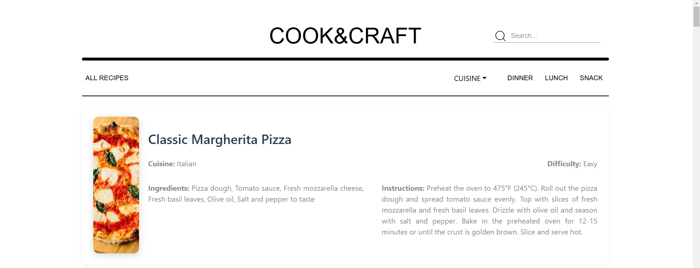

# 🍳 **CookCraft** 🥗

**A Modern & Elegant Recipe Application Built with React and TypeScript** ✨

---

## 🚀 **Overview**
CookCraft is a sleek and minimalistic recipe web application designed to provide users with an effortless way to explore delicious recipes from various cuisines. Whether you're planning a delightful dinner, a quick lunch, or a tasty snack, CookCraft has it all!

---

## 🛠️ **Tech Stack**
- **React** ⚛️
- **TypeScript** 📚
- **Redux Toolkit** 🛡️
- **Axios** 🌐
- **React Icons** 🎨
- **Toastify** 🍞
- **Bootstrap** 💎
- **Material UI (MUI)** 🖌️

---

## 📑 **Features**
- 🥘 **All Recipes, Dinner, Lunch, Snack Buttons:** Easily browse by meal type.
- 🌍 **Cuisine Dropdown:** Explore recipes from Italian, Thai, Japanese, and more.
- 🔍 **Search Functionality:** Find your favorite recipes with a smooth search experience.
- ⚡ **Dynamic Data:** Powered by [DummyJSON](https://dummyjson.com/).
- 🎯 **State Management:** Redux Toolkit ensures seamless state handling.
- 💬 **Notifications:** Real-time feedback using Toastify.

---

## 🎥 **Preview**



---

## 🛠️ **How to Run the Project**

1. Extract the file from the ZIP archive.

2. Navigate to the project directory:
   ```bash
   cd CookCraft
   ```

3. Install dependencies:
   ```bash
   npm install
   ```

4. Start the development server:
   ```bash
   npm run dev
   ```
---

🧑‍🍳 *"Cooking is love made visible."* 🍝

**Happy Cooking with CookCraft!** 🍴✨

